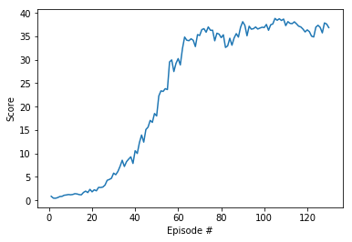

# Report

### Learning Algorithm
The agent learns through the Deep Deterministic Policy Gradients (DDPG) algorithm. It is amended to allow for distributed gathering of experience. The implementation of the DDPG algorithm is based on the research paper [
Continuous control with deep reinforcement learning](https://arxiv.org/abs/1509.02971). 

DDPG can be seen as an actor critic method and as an extension of the DQN algorithm for continuous action spaces. The actor learns to output a deterministic policy (the optimal action given a state) and the critic is a maximizer approximator. 
  
The model architecture for the actor and for the critic is to use a local and a target nerual network for each. Each network has two hidden layers. All layers are fully connected, using ReLu activation for the hidden layers, and tanh activation for the actor's output layer as well as linear activation for the critic's output layer. The exploration aspect is modeled by applying decaying Ornstein-Uhlenbek noise to the chosen action. The distributed learning is achieved the following way: 1) by letting all 20 copies of the arm collect experience, 2) by using the experience every 20 episodes to update the model 10 times in a row.
  
The following hyperparameters are used:
* size of first hidden layer (actor and critic): 400
* size of second hidden layer (actor and critic): 300
* replay buffer size: BUFFER_SIZE = int(1e6)
* minibatch size: BATCH_SIZE = 256
* discount factor: GAMMA = 0.99
* soft update factor TAU = 1e-3
* learning rate actor: LR_ACTOR = 1e-3
* learning rate critic: LR_CRITIC = 1e-3
* L2 weight decay: WEIGHT_DECAY = 0
* initial scale of noise: EPSILON = 1
* linear noise decay: EPSILON_DECAY = 1e-6
* update interval: UPDATE_INTERVAL = 20 
* number of updates: UPDATES_IN_A_ROW = 10

### Training Results
The trained agent solved the environment in 129 episodes. The following plot shows the average score per episode:

### Ideas for Future Work
* A different technique than DDPG could be explored. Various tachniques are benchmarked in [this paper](https://arxiv.org/abs/1604.06778)
* Improving the DDPG implementation: Using parameter noise instead of action noise. Advantages of the former are described in this [blog post by OpenAI](https://blog.openai.com/better-exploration-with-parameter-noise/)
* Improving the DDPG implementation: using [prioritized experience replay](https://arxiv.org/abs/1511.05952)
